# Irembo Voice AI Analytics Project

## Overview

This project evaluates whether Voice AI improves accessibility, efficiency, and adoption for public services.

The project includes:

* Data modeling (fact + staging)
* Behavioral analysis queries
* Friction simulation
* Success uplift projections
* Executive-ready analytical outputs

```mermaid

flowchart TD
  %% =========================
  %% External + Execution Layer
  %% =========================
  subgraph "Execution Environment (Manual SQL Workflow)"
    direction TB
    README["Run-order documentation (README)"]:::doc
    SQL_EDITOR["Supabase SQL Editor (manual execution)"]:::exec
    PG["PostgreSQL / Supabase Database Engine"]:::db
    README -->|"run_order"| SQL_EDITOR
    SQL_EDITOR -->|"executes_sql_in"| PG
  end

  %% =========================
  %% Source Data Layer
  %% =========================
  subgraph "Tier 1 — Raw Source Tables (Operational Data)"
    direction TB
    RAW_SESS[("Raw: Voice sessions (events)")]:::raw
    RAW_TURNS[("Raw: Turn-level logs (conversational turns)")]:::raw
    RAW_USERS[("Raw: Users (attributes/cohorts)")]:::raw
    RAW_APPS[("Raw: Applications (submission/outcome)")]:::raw
    RAW_METRICS[("Raw: Voice AI metrics (ASR/confidence/misunderstanding)")]:::raw
  end

  PG -->|"hosts_raw_tables"| RAW_SESS
  PG -->|"hosts_raw_tables"| RAW_TURNS
  PG -->|"hosts_raw_tables"| RAW_USERS
  PG -->|"hosts_raw_tables"| RAW_APPS
  PG -->|"hosts_raw_tables"| RAW_METRICS

  %% =========================
  %% Transformation Layer (Models)
  %% =========================
  subgraph "Tier 2 — Transformation Layer (models/)"
    direction TB

    STG_SESS[("models/stg_voice_sessions (session normalization)")]:::staging
    STG_USERS[("models/stg_users (user normalization)")]:::staging

    STG_TURNS[("models/stg_turn_agg (turn→session aggregation)")]:::staging
    TURN_NOTE["Grain transition: turn-level → session-level"]:::note

    STG_METRICS[("models/stg_voice_ai_metrics (AI metrics shaping)")]:::staging

    STG_APPS[("models/stg_applications (application shaping)")]:::staging
    DQ_DEDUP[("models/stg_applications_dedup (DQ gate: deduplicate applications)")]:::dq

    FACT[("models/fact_voice_ai_sessions (GOLD fact; session grain)")]:::fact
    FACT_GRAIN["Fact grain: 1 row per session (session-level contract)"]:::note
  end

  %% Source -> Staging
  RAW_SESS -->|"normalize"| STG_SESS
  RAW_USERS -->|"normalize"| STG_USERS
  RAW_TURNS -->|"aggregate"| STG_TURNS
  RAW_METRICS -->|"shape"| STG_METRICS
  RAW_APPS -->|"shape"| STG_APPS
  STG_APPS -->|"deduplicate"| DQ_DEDUP

  STG_TURNS -->|"Aggregate_turns→session"| TURN_NOTE

  %% Staging -> Fact (fan-in integration)
  STG_SESS -->|"join_(assumed)_on_session_id"| FACT
  STG_USERS -->|"join_(assumed)_on_user_id"| FACT
  STG_TURNS -->|"join_(assumed)_on_session_id"| FACT
  STG_METRICS -->|"join_(assumed)_on_session_id"| FACT
  DQ_DEDUP -->|"join_(assumed)_on_application_id"| FACT

  FACT -->|"semantic_contract"| FACT_GRAIN

  %% =========================
  %% Metric Definitions (Semantic Contract)
  %% =========================
  METRICS_BOX["Metric Definitions (semantic contract)\n- misunderstanding_threshold = 0.33\n- error = total_error_turns > 0\n- completion = session_completed_flag = TRUE\n- application_success = application_success_flag = TRUE"]:::callout

  METRICS_BOX -.->|"defines_fields/flags"| FACT

  %% =========================
  %% Analysis Layer
  %% =========================
  subgraph "Tier 3 — Analysis / Metrics Computation (analysis/*.sql)"
    direction TB

    subgraph "Descriptive Analytics (KPIs / Segmentation / Friction)"
      direction TB
      A01["01_basic_health_check.sql"]:::analysis
      A02["02_completion_by_channel.sql"]:::analysis
      A03["03_first_time_vs_others.sql"]:::analysis
      A04["04_high_vs_low_misunderstanding.sql"]:::analysis
      A05["05_time_to_submit_by_channel.sql"]:::analysis
      A06["06_friction_efficiency_impact.sql"]:::analysis
      A07["07_friction_severity_index.sql"]:::analysis
    end

    subgraph "What-if Modeling (Simulation / Projection)"
      direction TB
      A08["08_error_reduction_simulation.sql"]:::simulation
    end
  end

  FACT -->|"primary_input"| A01
  FACT -->|"primary_input"| A02
  FACT -->|"primary_input"| A03
  FACT -->|"primary_input"| A04
  FACT -->|"primary_input"| A05
  FACT -->|"primary_input"| A06
  FACT -->|"primary_input"| A07
  FACT -->|"primary_input"| A08

  METRICS_BOX -.->|"used_by"| A02
  METRICS_BOX -.->|"used_by"| A04
  METRICS_BOX -.->|"used_by"| A06
  METRICS_BOX -.->|"used_by"| A07
  METRICS_BOX -.->|"used_by"| A08

  %% =========================
  %% BI / Consumption Layer
  %% =========================
  subgraph "Tier 4 — BI / Consumption (Metabase)"
    direction TB
    MB["Metabase Dashboards / Saved Questions"]:::bi
    PDF1["PDF Export: Irembo_VoiceAi_Dashboard.pdf"]:::artifact
    PDF2["PDF Export: Irembo_VoiceAi_Report.pdf"]:::artifact
  end

  A01 -->|"feeds"| MB
  A02 -->|"feeds"| MB
  A03 -->|"feeds"| MB
  A04 -->|"feeds"| MB
  A05 -->|"feeds"| MB
  A06 -->|"feeds"| MB
  A07 -->|"feeds"| MB
  A08 -->|"feeds"| MB

  MB -->|"export_pdf"| PDF1
  MB -->|"export_pdf"| PDF2

  %% =========================
  %% Click Events (from component_mapping)
  %% =========================
  click STG_SESS "https://github.com/ibrahim-sani/irembo_voice_ai_analysis/blob/main/models/stg_voice_sessions.sql"
  click STG_USERS "https://github.com/ibrahim-sani/irembo_voice_ai_analysis/blob/main/models/stg_users.sql"
  click STG_TURNS "https://github.com/ibrahim-sani/irembo_voice_ai_analysis/blob/main/models/stg_turn_agg.sql"
  click STG_METRICS "https://github.com/ibrahim-sani/irembo_voice_ai_analysis/blob/main/models/stg_voice_ai_metrics.sql"
  click STG_APPS "https://github.com/ibrahim-sani/irembo_voice_ai_analysis/blob/main/models/stg_applications.sql"
  click DQ_DEDUP "https://github.com/ibrahim-sani/irembo_voice_ai_analysis/blob/main/models/stg_applications_dedup.sql"
  click FACT "https://github.com/ibrahim-sani/irembo_voice_ai_analysis/blob/main/models/fact_voice_ai_sessions.sql"

  click A01 "https://github.com/ibrahim-sani/irembo_voice_ai_analysis/blob/main/analysis/01_basic_health_check.sql"
  click A02 "https://github.com/ibrahim-sani/irembo_voice_ai_analysis/blob/main/analysis/02_completion_by_channel.sql"
  click A03 "https://github.com/ibrahim-sani/irembo_voice_ai_analysis/blob/main/analysis/03_first_time_vs_others.sql"
  click A04 "https://github.com/ibrahim-sani/irembo_voice_ai_analysis/blob/main/analysis/04_high_vs_low_misunderstanding.sql"
  click A05 "https://github.com/ibrahim-sani/irembo_voice_ai_analysis/blob/main/analysis/05_time_to_submit_by_channel.sql"
  click A06 "https://github.com/ibrahim-sani/irembo_voice_ai_analysis/blob/main/analysis/06_friction_efficiency_impact.sql"
  click A07 "https://github.com/ibrahim-sani/irembo_voice_ai_analysis/blob/main/analysis/07_friction_severity_index.sql"
  click A08 "https://github.com/ibrahim-sani/irembo_voice_ai_analysis/blob/main/analysis/08_error_reduction_simulation.sql"

  click PDF1 "https://github.com/ibrahim-sani/irembo_voice_ai_analysis/blob/main/metabase_report/Irembo_VoiceAi_Dashboard.pdf"
  click PDF2 "https://github.com/ibrahim-sani/irembo_voice_ai_analysis/blob/main/metabase_report/Irembo_VoiceAi_Report.pdf"
  click README "https://github.com/ibrahim-sani/irembo_voice_ai_analysis/blob/main/README.md"

  %% =========================
  %% Styles
  %% =========================
  classDef raw fill:#ECEFF1,stroke:#546E7A,stroke-width:1px,color:#263238
  classDef staging fill:#E3F2FD,stroke:#1E88E5,stroke-width:1px,color:#0D47A1
  classDef dq fill:#FFF3E0,stroke:#FB8C00,stroke-width:2px,color:#E65100
  classDef fact fill:#F3E5F5,stroke:#8E24AA,stroke-width:3px,color:#4A148C
  classDef analysis fill:#E8F5E9,stroke:#43A047,stroke-width:1px,color:#1B5E20
  classDef simulation fill:#DFF7E3,stroke:#2E7D32,stroke-width:3px,color:#1B5E20
  classDef bi fill:#FFE0B2,stroke:#EF6C00,stroke-width:2px,color:#E65100
  classDef artifact fill:#FFCCBC,stroke:#D84315,stroke-width:2px,color:#BF360C
  classDef callout fill:#FFF9C4,stroke:#F9A825,stroke-width:2px,color:#5D4037
  classDef note fill:#FFFDE7,stroke:#FBC02D,stroke-width:1px,color:#5D4037
  classDef exec fill:#E0F7FA,stroke:#00838F,stroke-width:2px,color:#004D40
  classDef db fill:#E0E0E0,stroke:#424242,stroke-width:2px,color:#212121
  classDef doc fill:#E1F5FE,stroke:#0277BD,stroke-width:2px,color:#01579B
```

# Data Model

Primary fact table:

analytics.fact_voice_ai_sessions

This fact table integrates:

* Voice session data
* User attributes
* AI performance metrics
* Application outcomes
* Turn-level aggregations

# How To Run The Code

This project was developed using PostgreSQL (Supabase).

 Supabase SQL Editor

1. Connect to your Supabase project
2. Open SQL Editor
3. Run staging scripts first:

* stg_voice_sessions.sql
*  stg_users.sql
*   stg_turn_agg.sql
*  stg_voice_ai_metrics.sql
*  stg_applications.sql
  
     
4. Run fact model:

* fact_voice_ai_sessions.sql

  
5. Run analysis queries inside the `analysis/` folder

## Assumptions

* Session-level aggregation used for modeling
* Misunderstanding threshold set at 0.33
* Error defined as total_error_turns > 0
* Completion defined as session_completed_flag = TRUE

Application success defined as application_success_flag = TRUE

## Tools Used

PostgreSQL (Supabase)

Metabase (Dashboard visualization)

SQL modeling

Friction simulation modeling

Author:

Ibrahim Sani
Data Analytics Engineer, Consultant  – Irembo Voice AI

